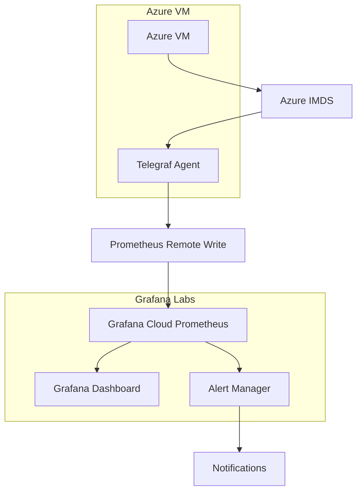

# Telegraf Azure Scheduled Events Monitoring

## Overview

This solution provides comprehensive monitoring of Azure scheduled events using Telegraf to collect metrics and send them to Grafana Labs in InfluxDB format while storing in Prometheus datastore. It enables proactive monitoring of Azure VM maintenance events, scheduled operations, and platform-initiated changes.

## Architecture



### Components

1. **Azure Instance Metadata Service (IMDS)**: Provides scheduled events data
2. **Telegraf Agent**: Collects metrics from Azure IMDS and system resources
3. **Grafana Cloud Prometheus**: Stores metrics in Prometheus format
4. **Grafana Dashboard**: Visualizes scheduled events and VM metadata
5. **Alert Manager**: Handles alerting for critical events

## Monitored Events

### Azure Scheduled Events
- **Preempt**: VM preemption (spot instances)
- **Freeze**: Temporary VM pause
- **Reboot**: VM restart events
- **Redeploy**: VM migration to different hardware
- **Terminate**: VM termination

### Event Severity Classification
- **Critical**: Preempt, Freeze (immediate attention required)
- **High**: Reboot, Redeploy (planning required)
- **Medium**: Other events (monitoring required)

### Additional Monitoring
- **Azure IMDS Health**: Connectivity and response time
- **VM Metadata**: Instance information and changes
- **Telegraf Agent Health**: Monitoring system status

## Directory Structure

```
monitoring/telegraf/
├── telegraf.conf                          # Main Telegraf configuration
├── telegraf.env                           # Environment variables
├── conf.d/
│   ├── azure_scheduled_events.conf        # Azure events input configuration
│   └── prometheus_output.conf             # Prometheus output configuration
├── systemd/
│   └── telegraf.service                   # Systemd service file
├── scripts/
│   ├── install-telegraf-azure.sh          # Installation script
│   └── validate-telegraf-config.sh        # Configuration validation
└── README.md                              # This documentation

monitoring/grafana/
├── dashboards/
│   └── azure-scheduled-events.json        # Grafana dashboard
└── alerts/
    └── azure-scheduled-events-alerts.yaml # Alert rules
```

## Prerequisites

### System Requirements
- **RHEL 8+ or Windows Server 2019+**
- **Running on Azure VM** (access to IMDS required)
- **Root/Administrator access**
- **Internet connectivity**

### Grafana Cloud Requirements
- **Grafana Cloud account** with Prometheus access
- **API key** with MetricsPublisher role
- **Remote write endpoint** URL and credentials

## Installation

### Step 1: Prepare Grafana Cloud

1. Sign up for [Grafana Cloud](https://grafana.com/products/cloud/)
2. Navigate to **Prometheus** data source configuration
3. Generate an API key with MetricsPublisher role
4. Note your remote write endpoint and credentials

Example endpoints by region:
- US Central: `https://prometheus-prod-13-prod-us-east-0.grafana.net/api/prom/push`
- EU West: `https://prometheus-prod-01-eu-west-0.grafana.net/api/prom/push`

### Step 2: Download and Install

```bash
# Navigate to monitoring directory
cd /path/to/sn_acc/monitoring/telegraf

# Make installation script executable
chmod +x scripts/install-telegraf-azure.sh

# Run installation (as root)
sudo ./scripts/install-telegraf-azure.sh
```

### Step 3: Configure Credentials

Edit the environment file with your Grafana Cloud credentials:

```bash
sudo nano /etc/default/telegraf
```

Update the following variables:
```bash
# Grafana Cloud Prometheus Configuration
PROMETHEUS_REMOTE_WRITE_URL=https://prometheus-prod-13-prod-us-east-0.grafana.net/api/prom/push
PROMETHEUS_USERNAME=your_instance_id
PROMETHEUS_PASSWORD=your_grafana_cloud_api_key

# Environment Configuration
ENVIRONMENT=production
HOSTNAME=$(hostname)

# Optional: Custom labels
CUSTOM_TEAM_LABEL=infrastructure
CUSTOM_PROJECT_LABEL=azure-monitoring
```

### Step 4: Start and Verify

```bash
# Restart Telegraf service
sudo systemctl restart telegraf

# Check service status
sudo systemctl status telegraf

# Validate configuration
sudo ./scripts/validate-telegraf-config.sh

# Test metrics endpoint
curl http://localhost:9273/metrics | grep azure
```

## Configuration Details

### Telegraf Configuration

#### Main Configuration (`telegraf.conf`)
- **Agent settings**: Collection interval, batching, buffering
- **Global tags**: Environment, service, agent type labels
- **Basic system metrics**: CPU, memory, system load

#### Azure Scheduled Events (`conf.d/azure_scheduled_events.conf`)
- **IMDS API Version**: Uses latest stable version `2021-12-13`
- **Rate Limiting**: 30-second intervals (complies with Microsoft recommendations)
- **Security Headers**: Proper `Metadata: true` and User-Agent headers
- **Data Privacy**: Excludes sensitive fields per Microsoft guidelines
- **JSON parsing**: Extracts event details and metadata safely
- **Data processing**: Adds severity classification without exposing sensitive data
- **Health monitoring**: Monitors IMDS connectivity using minimal endpoints

#### Prometheus Output (`conf.d/prometheus_output.conf`)
- **Remote write**: Sends metrics to Grafana Cloud
- **Local endpoint**: Exposes metrics for local scraping
- **Authentication**: Uses environment variables for credentials

### Key Features

#### Event Processing
- Real-time event collection (30-second intervals for rate limiting compliance)
- Automatic severity classification (Critical/High/Medium)
- Maintenance type detection (planned vs unplanned)
- Event count and duration tracking
- **Data sanitization**: Removes sensitive information from descriptions
- **Field filtering**: Excludes sensitive metadata fields

#### Metadata Collection
- **Non-sensitive VM information** from Azure IMDS only
- Essential configuration details (location, size, OS type)
- **Logical Zone**: Azure Availability Zone assignment
- **Physical Placement**: Platform fault and update domains
- **Placement Groups**: VM Scale Set and placement group information
- **Excluded sensitive fields**: customData, userData, publicKeys, resourceId, subscriptionId, vmId
- **Rate-limited collection**: 5-minute intervals to respect IMDS limits

#### Zone Information Monitoring
- **Logical Zone**: Azure Availability Zone (1, 2, 3, or empty for non-zonal)
- **Physical Fault Domain**: Hardware isolation boundary
- **Physical Update Domain**: Maintenance coordination boundary
- **Placement Group ID**: Scale set placement group identifier
- **Zone Health**: Availability and configuration status

#### Health Monitoring
- IMDS connectivity checks
- Response time monitoring
- Agent health verification
- Configuration validation

## Grafana Dashboard

### Dashboard Features

1. **Overview Statistics**
   - Total active scheduled events
   - Number of affected VMs
   - Azure IMDS health status
   - Critical events count

2. **Timeline Visualization**
   - Events over time by severity
   - Event type distribution
   - Maintenance windows

3. **Event Details Table**
   - Current events with full details
   - Sortable and filterable columns
   - Color-coded severity levels

4. **VM Metadata Display**
   - Instance information
   - Location and size details
   - Network configuration

### Installation

1. Import the dashboard JSON file:
   ```bash
   # Copy dashboard to accessible location
   cp monitoring/grafana/dashboards/azure-scheduled-events.json /tmp/
   ```

2. In Grafana Cloud:
   - Go to **Dashboards** → **Import**
   - Upload `azure-scheduled-events.json`
   - Configure Prometheus data source

## Alerting

### Alert Rules

#### Critical Alerts (Immediate Response)
- **VM Preemption**: Spot instance termination
- **VM Freeze**: Temporary suspension
- **IMDS Down**: Monitoring system failure

#### High Priority Alerts (Planning Required)
- **VM Reboot**: Scheduled restart
- **VM Redeploy**: Hardware migration

#### Warning Alerts (Monitoring)
- **Multiple Events**: Complex maintenance
- **Long Duration**: Extended windows
- **Agent Issues**: Monitoring problems

### Setup in Grafana Cloud

1. Navigate to **Alerting** → **Alert Rules**
2. Import rules from `azure-scheduled-events-alerts.yaml`
3. Configure notification policies:
   - Critical: Immediate notification
   - High: 30s grouping
   - Warning: 2m grouping

### Notification Configuration

Example Slack integration:
```yaml
contact_points:
  - name: critical-azure-alerts
    slack:
      channel: "#critical-alerts"
      title: "🚨 CRITICAL: Azure Scheduled Event"
      text: |
        *Alert:* {{ .Annotations.summary }}
        *Host:* {{ .Labels.hostname }}
        *Event:* {{ .Labels.EventType }}
        *Status:* {{ .Labels.EventStatus }}
```

## Monitoring and Maintenance

### Health Checks

```bash
# Check Telegraf service
sudo systemctl status telegraf

# View recent logs
sudo journalctl -u telegraf -f

# Validate configuration
telegraf --config /etc/telegraf/telegraf.conf --test

# Test Azure connectivity
curl -H "Metadata:true" "http://169.254.169.254/metadata/scheduledevents?api-version=2020-07-01"
```

### Performance Tuning

For high-frequency environments, adjust collection intervals:

```bash
# Edit environment file
sudo nano /etc/default/telegraf

# Add performance settings
SCHEDULED_EVENTS_INTERVAL=5s
VM_METADATA_INTERVAL=300s
HEALTH_CHECK_INTERVAL=60s
```

### Log Management

Telegraf logs are managed via systemd:
```bash
# View logs
journalctl -u telegraf -n 100

# Follow logs in real-time
journalctl -u telegraf -f

# Check log rotation
sudo logrotate -d /etc/logrotate.d/telegraf
```

## Troubleshooting

### Common Issues

#### 1. No Azure Metrics Reported
**Symptoms**: Dashboard shows no data
**Causes**: 
- Not running on Azure VM
- IMDS connectivity issues
- Configuration errors

**Resolution**:
```bash
# Test IMDS connectivity
curl -H "Metadata:true" --max-time 5 "http://169.254.169.254/metadata/instance?api-version=2021-02-01"

# Check Telegraf configuration
telegraf --config /etc/telegraf/telegraf.conf --test

# Verify service status
systemctl status telegraf
```

#### 2. Authentication Errors
**Symptoms**: Metrics not reaching Grafana Cloud
**Causes**: Invalid credentials, wrong endpoint

**Resolution**:
```bash
# Verify credentials
sudo nano /etc/default/telegraf

# Test endpoint manually
curl -u "username:password" -X POST "your_prometheus_endpoint"

# Check logs for auth errors
journalctl -u telegraf | grep -i auth
```

#### 3. High Memory Usage
**Symptoms**: Telegraf consuming excessive memory
**Causes**: Large buffer sizes, high frequency collection

**Resolution**:
```bash
# Adjust buffer settings in telegraf.conf
metric_buffer_limit = 5000
metric_batch_size = 500

# Increase collection intervals
interval = "30s"
```

### Validation Script

Run the comprehensive validation script:
```bash
sudo ./scripts/validate-telegraf-config.sh
```

This script checks:
- Telegraf installation and configuration
- Azure IMDS connectivity
- Service status and health
- Metrics endpoint accessibility
- Log file permissions

## Security Considerations

### Azure IMDS Security Best Practices

This solution follows Microsoft's security guidelines for Azure Instance Metadata Service (IMDS):

#### Data Privacy
- **No Sensitive Data Collection**: Excludes sensitive fields like `customData`, `userData`, `publicKeys`, `resourceId`, `subscriptionId`, and `vmId`
- **Data Sanitization**: Automatically removes or truncates potentially sensitive information
- **Minimal Data Exposure**: Collects only essential metadata required for monitoring

#### Rate Limiting Compliance
- **Microsoft Recommendation**: Maximum 5 requests per second to IMDS
- **Implementation**: 
  - Scheduled events: 30-second intervals (~2 requests/min)
  - VM metadata: 5-minute intervals (~12 requests/hour)
  - Health checks: 60-second intervals (~1 request/min)
- **Total Rate**: Well below Microsoft's recommended limits

#### API Version Management
- **Latest Stable Version**: Uses API version `2021-12-13`
- **Proper Headers**: Includes required `Metadata: true` and custom User-Agent
- **Timeout Handling**: 10-second timeout (Microsoft's recommended maximum)

#### Network Security
- IMDS endpoint (169.254.169.254) must be accessible
- Outbound HTTPS access to Grafana Cloud required
- Local metrics endpoint on port 9273 (optional firewall rule)

### IMDS Security Features

#### Automatic Data Sanitization
The configuration automatically sanitizes collected data:
```toml
# Processor removes sensitive fields
sensitive_fields = ["customData", "userData", "publicKeys", "resourceId", "subscriptionId", "vmId"]
```

#### Rate Limiting Configuration
Complies with Microsoft's IMDS rate limiting guidelines:
```bash
# Environment variables for rate limiting
SCHEDULED_EVENTS_INTERVAL=30s  # Max ~2 requests/min
VM_METADATA_INTERVAL=300s      # Max ~12 requests/hour 
HEALTH_CHECK_INTERVAL=60s      # Max ~1 request/min
```

#### Security Validation
The validation script checks for:
- Sensitive data exposure
- Rate limiting compliance
- API version currency
- Proper authentication headers
- Environment file permissions set to 600
- API keys stored in secure environment variables
- No credentials in configuration files

### Service Security
- Runs as dedicated telegraf user
- Systemd security restrictions enabled
- Limited filesystem access

## Advanced Configuration

### Custom Processors

Add custom data processing:
```toml
[[processors.starlark]]
script = '''
def apply(metric):
    # Custom event classification
    if metric.name == "azure_scheduled_events":
        event_type = metric.tags.get("EventType", "")
        if event_type == "CustomEvent":
            metric.tags["priority"] = "high"
    return metric
'''
```

### Additional Inputs

Monitor more Azure services:
```toml
# Azure Application Insights
[[inputs.http]]
name_override = "azure_app_insights"
urls = ["https://api.applicationinsights.io/v1/apps/your-app-id/metrics/requests/count"]
headers = { "X-API-Key" = "$APP_INSIGHTS_KEY" }
```

### Output Flexibility

Multiple output destinations:
```toml
# Local Prometheus for testing
[[outputs.prometheus_client]]
listen = ":9274"

# File output for debugging
[[outputs.file]]
files = ["/var/log/telegraf/metrics.log"]
data_format = "influx"
```

## Integration with Existing Monitoring

### ServiceNow Integration
This monitoring solution complements the existing `sn_acc` (ServiceNow Agent Client Collector) by providing:
- Real-time event alerting vs. scheduled data collection
- Azure-specific event monitoring vs. general system monitoring
- Proactive maintenance planning vs. reactive issue response

### Ansible Deployment
Create Ansible playbook for automated deployment:
```yaml
- name: Deploy Telegraf Azure Monitoring
  hosts: azure_vms
  become: yes
  tasks:
    - name: Copy Telegraf configurations
      copy:
        src: "{{ item }}"
        dest: "/etc/telegraf/"
      with_fileglob:
        - "telegraf/conf.d/*.conf"
        - "telegraf/telegraf.conf"
    
    - name: Install and start Telegraf
      include_role:
        name: telegraf-azure
```

## Support and Resources

### Documentation Links
- [Azure Scheduled Events API](https://docs.microsoft.com/en-us/azure/virtual-machines/scheduled-events)
- [Telegraf Configuration](https://docs.influxdata.com/telegraf/v1.24/configuration/)
- [Grafana Cloud Prometheus](https://grafana.com/docs/grafana-cloud/prometheus/)

### Useful Commands
```bash
# Configuration test
telegraf --config /etc/telegraf/telegraf.conf --test

# One-time metric collection
telegraf --config /etc/telegraf/telegraf.conf --once

# Debug mode
telegraf --config /etc/telegraf/telegraf.conf --debug

# Check Azure IMDS
curl -H "Metadata:true" "http://169.254.169.254/metadata/scheduledevents?api-version=2020-07-01" | jq
```

### Contributing

To improve this monitoring solution:
1. Test configuration changes in development environment
2. Update validation scripts for new features
3. Document any custom processors or inputs
4. Submit improvements via pull request

---

**Note**: This solution is specifically designed for Azure VMs and requires access to the Azure Instance Metadata Service. It will not function on non-Azure systems.